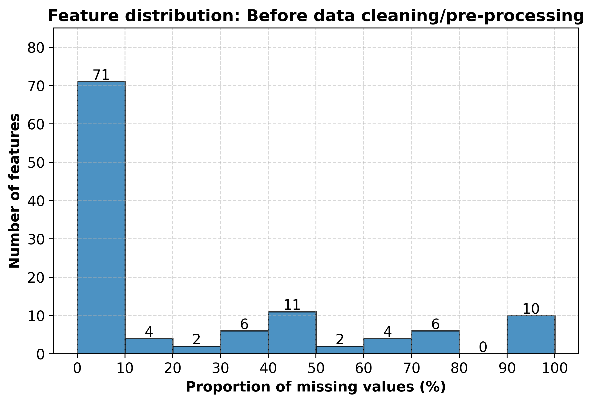
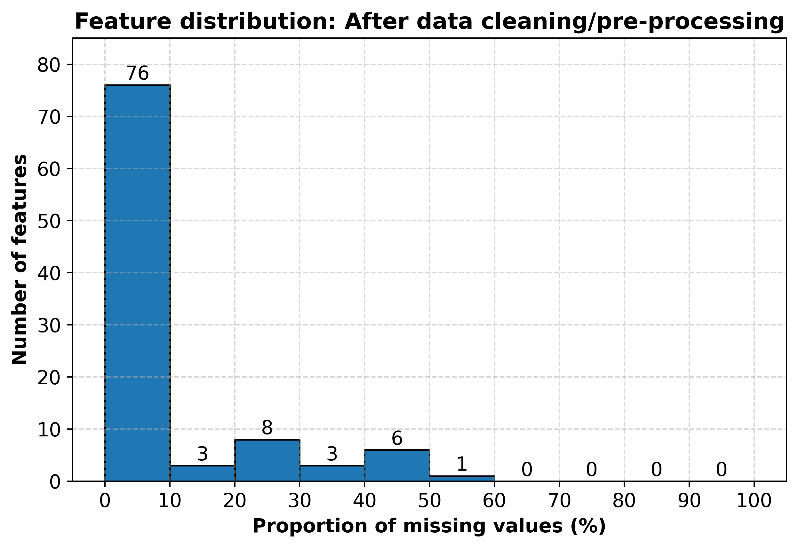
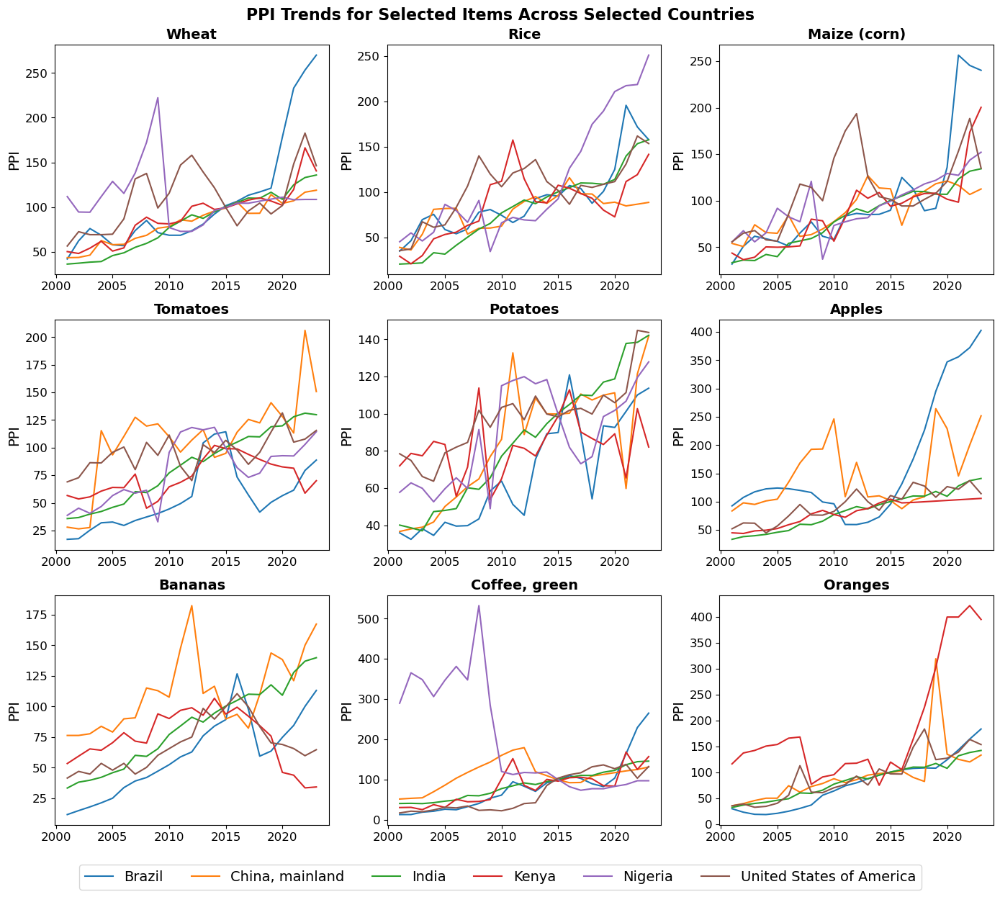

# 🌾 Forecasting Farmer Prices (FAOSTAT)

Predicting agricultural Producer Price Index (PPI) for the year 2023 across countries and crops using multi-panel FAOSTAT data.

This project develops a structured workflow to clean, integrate, and impute a global dataset of agronomic, trade, economic, and environmental indicators, then applies machine-learning and deep-learning models to predict PPI and assess the relative importance of predictors influencing price variation.

**Why this matters:** 
- **For farmers:** a reliable price outlook helps decide what to plant and how much land to allocate, balancing profitability and risk before the season begins.

- **For policymakers and economists:** price signals guide subsidy design, import–export policy, and food-security planning, ensuring support reaches crops and regions that need it most.

- **For financial institutions:** predicted price strength offers a proxy for repayment capacity, informing agricultural credit, insurance, and investment decisions.

## Repository Map

- **Data cleaning notebooks:** [here](https://github.com/Leonidus1995/farmer-prices-forecasting/tree/main/files_data_cleaning)

- **Database + integration:** [here](https://github.com/Leonidus1995/farmer-prices-forecasting/tree/main/database_files)

- **Preprocessing:** [here](https://github.com/Leonidus1995/farmer-prices-forecasting/blob/main/pre_processing.ipynb)

- **Imputation:** 
    - [Assessment for imputation](https://github.com/Leonidus1995/farmer-prices-forecasting/blob/main/data_imputation.ipynb)
    - [Imputation of 55 item-independent columns (LightGBM)](https://github.com/Leonidus1995/farmer-prices-forecasting/blob/main/dataset_1.ipynb)
    - [Imputation of 15 item-independent columns (KNN, TVAE)](https://github.com/Leonidus1995/farmer-prices-forecasting/blob/main/dataset_1_second.ipynb)
    - [Imputation of 8 item-dependent columns](https://github.com/Leonidus1995/farmer-prices-forecasting/blob/main/dataset_1_third.ipynb)

- **Post-Imputation Data Exploration:** [here](https://github.com/Leonidus1995/farmer-prices-forecasting/blob/main/eda.ipynb)

- **Models:**
    - [Baseline model](https://github.com/Leonidus1995/farmer-prices-forecasting/blob/main/base_model.py)
    - [LightGBM model](https://github.com/Leonidus1995/farmer-prices-forecasting/blob/main/LightGBM.py)
    - [Neural Net model](https://github.com/Leonidus1995/farmer-prices-forecasting/blob/main/NeuralNet.ipynb)

- **Model Evaluation Results (on 2023 testing year):**
    - Baseline: RMSE = 127.61, MAE = 43.49, R² = 0.56 

    - LightGBM: RMSE = 101.28, MAE = 38.44, R² = 0.73

    - Neural Net: RMSE = 177.49, MAE = 67.52, R² = 0.157

- **Figures/Plots:** [here](https://github.com/Leonidus1995/farmer-prices-forecasting/tree/main/plots)

## Data Sources ([FAOSTAT](https://www.fao.org/faostat/en/#data))

Target + predictors assembled yearly by (country × item):

- **Target:** Producer Price Index (PPI) (we drop sparse raw producer_price in favor of PPI coverage).

- **Predictors:** Agronomic (production/yield/area), trade (imports/exports, openness indices), inputs (fertilizer/pesticide), macro indicators (GDP, value added), government finance (expenditure, credit), FDI, employment/demographics, climate/environment (temperature, emissions), and land use.

## Pipeline Overview

## Ingest & Clean (per-dataset):

- Raw CSVs from FAOSTAT cleaned with Pandas.

- Notebooks: [here](https://github.com/Leonidus1995/farmer-prices-forecasting/tree/main/files_data_cleaning)

- Pre-clean feature coverage: 
    

## Relational Integration (PostgreSQL):

- Create tables + load cleaned data → integrate by (area/country, year, item).

- Code & SQL: [here](https://github.com/Leonidus1995/farmer-prices-forecasting/tree/main/database_files)

## Pre-processing & Feature Reduction:

- Start: 392,856 rows × 116 features.

- Drop 10 features with >90% missingness (e.g., market concentration indexes, self-sufficiency ratio, etc.).

- Item filtering: remove 43 animal-related items + 25 systematically sparse items → retain 134 items.

- Country filtering: retain 149/166 countries by excluding those with complete gaps in two key employment/credit features.

- After reduction: 211,006 rows × 97 features.

- Post-clean coverage:
    

- Notebook: [here](https://github.com/Leonidus1995/farmer-prices-forecasting/blob/main/pre_processing.ipynb) 

## Missing Data Assessment → Imputation Plan

**Pain points:** Six variables had concentrated gaps (esp. 1990–2000 and 2024) including government expenditure and employment. We tested an analytical reconstruction of govt_expenditure_on_ag_forest_fish using AOI × ag share of GDP × total gov expenditure and reverted after observing bias.

### Key decisions:

- Target switched to PPI (better coverage); drop raw producer_price.

- Add regional/economic indicator columns (region, sub-region, LDC, EU, LIFDC) to enable context-aware imputation.

- Derive value_added_aff_per_total_fdi to retain investment signal while avoiding sparse raw FDI fields.

- Dual dataset strategy to respect temporal gaps:

    - Dataset-1 (2001–2023): keep all 106 features, avoid the early-decade missing blocks.

    - Dataset-2 (1991–2023): drop the 6 chronically sparse features to preserve the full time span.

*Where to look:*

- Figures:
    - [Pairwise correlations in missingness (top 40 variables)](https://github.com/Leonidus1995/farmer-prices-forecasting/blob/main/plots/heatmap_top40.png)
    - [Matrix-plot for missingness (top 30 variables)](https://github.com/Leonidus1995/farmer-prices-forecasting/blob/main/plots/matrixplot_top30.png)
    - [Heatmap displaying data coverage (top 30 variables)](https://github.com/Leonidus1995/farmer-prices-forecasting/blob/main/plots/heatmap_missing_top30.png)

- Detailed narrative + decisions: [here](https://github.com/Leonidus1995/farmer-prices-forecasting/blob/main/data_imputation.ipynb)

## Imputation Methods (Dataset-1 focus)

**Guardrails:**

- No look-ahead (train-window imputation only: 2001–2021).

- Split scope: country-only vs. country×item variables.

- Short gaps: linear, LOCF/NOCB.

- Climate deltas (low missingness): sub-region means.

- Fertilizer production zero-logic (nitrogen/phosphorus): rules for plausible zeros at series edges / majority-zero series.

**ML imputation for item-independent predictors (55 columns):**

- LightGBM, column-wise, from lowest → highest missingness so later models can borrow newly imputed predictors.

- Train on non-missing rows (2001–2021); 10% validation split.

- Objective: Tweedie for non-negative targets, otherwise regression.

- Keep imputed columns only if they pass all: R² ≥ 0.70, MAPE ≤ 50%, nRMSE_mean ≤ 0.5.

- Results & table: see metrics → [impute_metrics.html](https://github.com/Leonidus1995/farmer-prices-forecasting/blob/main/impute_metrics.html)

**For 15 hard columns:**

Compared LightGBM vs. TVAE vs. KNN-Imputer on a pooled, fully-observed subset
(excluding 2023, one validation row per country; 1,931 train / 112 val).

- Imputation results:

    - [metrics_lgbm.html](https://github.com/Leonidus1995/farmer-prices-forecasting/blob/main/metrics_lgbm.html)
    - [metrics_knn.html](https://github.com/Leonidus1995/farmer-prices-forecasting/blob/main/metrics_knn.html)
    - [metrics_tvae.html](https://github.com/Leonidus1995/farmer-prices-forecasting/blob/main/metrics_tvae.html)

*Useful visuals:*

- [Temporal trends](https://github.com/Leonidus1995/farmer-prices-forecasting/tree/main/plots/temporal_trends) → simple interpolation for stable trends and machine-learning methods for irregular or sparse series.

- [Weak autocorrelation](https://github.com/Leonidus1995/farmer-prices-forecasting/tree/main/plots/Autocorrelation) → favors cross-sectional ML over ARIMA for imputation:

*Notebooks:*
 - [Assessment for imputation](https://github.com/Leonidus1995/farmer-prices-forecasting/blob/main/data_imputation.ipynb)
 - [Imputation of 55 item-independent columns (LightGBM)](https://github.com/Leonidus1995/farmer-prices-forecasting/blob/main/dataset_1.ipynb)
- [Imputation of 15 item-independent columns (KNN, TVAE)](https://github.com/Leonidus1995/farmer-prices-forecasting/blob/main/dataset_1_second.ipynb)
- [Imputation of 8 item-dependent columns](https://github.com/Leonidus1995/farmer-prices-forecasting/blob/main/dataset_1_third.ipynb)
    
    

## Post-Imputation Data Exploration

Carried out a post-imputation exploratory analysis to validate data integrity and understand variable distributions and relationships before modeling.

### Key Takeaways:

- Heavy right-skewness in most predictors.

- Applying transformations (log(1+x), Yeo–Johnson and Quantile) stabilized variance and improved symmetry.

- Several variables exhibited multimodal distributions, hinting at clusters among small, mid-tier, and large economies.

- Features with both positive and negative values decomposed into positive, negative, and binary-indicator components to retain information and stabilize scale.

- Asia, and to a lesser extent Africa and the Americas, showed stronger relative price growth in recent years, especially for major crops.

- Europe and Oceania maintained comparatively stable PPI trends.

- No predictor showed a strong direct correlation with PPI.

- Multiple feature clusters, suggesting multicollinearity that may require dimensionality reduction or feature selection in modeling.

*Useful Plots*
- [Feature Distributions](https://github.com/Leonidus1995/farmer-prices-forecasting/tree/main/plots/Feature_distributions)

- [Correlation Plots](https://github.com/Leonidus1995/farmer-prices-forecasting/tree/main/plots/Correlation_eda)

For details click [here](https://github.com/Leonidus1995/farmer-prices-forecasting/blob/main/eda.ipynb).

## Modeling

**Target:** producer_price_index (PPI)

**Baseline:** 

- Mean of prior three years (2020–2022) per country-item.

- Easy to compute and provides a yardstick for more complex models.

- Code: [base_model.py](https://github.com/Leonidus1995/farmer-prices-forecasting/blob/main/base_model.py)

**Gradient-boosted trees (LightGBM)** with cross-sectional signals:

- Trained on data from 2001-2021, with 2022 held out for validation and hyperparameter tuning (manual grid search).

- The best performing model was retrained on combined 2001-2022 data and applied to predict 2023 PPI values.

- Hyperparams from best model: learning_rate=0.03, num_boost_round=5000 (early stop), num_leaves≈30, max_depth=6, min_data_in_leaf=100, feature_fraction=0.8, bagging_fraction=0.8, bagging_freq=2, reg_alpha=2, reg_lambda=2, max_bin=80.

- Code: [LightGBM.py](https://github.com/Leonidus1995/farmer-prices-forecasting/blob/main/LightGBM.py)

**Neural Net Model:** a fully connected neural network in PyTorch

- *Inputs:*
  - 92 continuous numeric predictors (production, trade, macro, climate, etc.)
  - 12 binary indicators (e.g., LDC status, negative nutrient balance flags)
  - 4 categorical variables with learnable embeddings:
    - Country (Area) – 147 levels → 16-dim embedding
    - Commodity (Item) - 130 levels → 16-dim embedding
    - Region – 5 levels → 2-dim embedding
    - Sub-region – 21 levels → 4-dim embedding

- *Preprocessing:*
  - Continuous features transformed with Yeo–Johnson and standardized (fit on 2001–2021, then applied to 2022–2023).
  - Target PPI transformed with `log(1 + x)` to stabilize variance.

- *Architecture & training:*
  - Concatenate all embeddings + scaled numeric/binary features → MLP with 3 hidden layers (256 → 128 → 64 units).
  - Each hidden layer uses BatchNorm, ReLU activation, and dropout (p = 0.2).
  - Trained with AdamW (lr = 0.001, weight decay = 1e-4) and MSE loss.
  - Trained on 2001–2021, with 2022 as a hold-out validation year for early stopping; final model retrained on 2001–2022 and used to predict 2023 PPI.

## Model Evaluation:

**Baseline:**

- Performance on 2023 test set: **RMSE = 127.61; MAE = 43.49; R² = 0.56**

- True vs. Predicted plot: [here](https://github.com/Leonidus1995/farmer-prices-forecasting/blob/main/plots/Base_true_vs_predicted.png)

**LightGBM:**

- Training fit: RMSE = 17.78; MAE = 10.78; R² = 0.91

- Performance on 2023 test set: **RMSE = 101.28; MAE = 38.44; R² = 0.73**

- Generalizes well and markedly outperforms the naive averaging approach

- Errors widen at very high PPI values (volatility/extremes)

- True vs. Predicted plot: [here](https://github.com/Leonidus1995/farmer-prices-forecasting/blob/main/plots/LightGBM_true_vs_predicted.png)

- Top 15 features by importance: [here](https://github.com/Leonidus1995/farmer-prices-forecasting/blob/main/plots/LightGBM_feature_imp_top15.png)

**Neural Net:**

- Training a fully connected network with country/item embeddings did not outperform the simpler models on the 2023 hold-out year. 

- Performance on 2023 test set: **RMSE = 177.49; MAE = 67.52; R² = 0.16**

- The model substantially under-predicted high PPI values, leading to larger errors than both the rolling-average baseline and the LightGBM model.

- True vs. Predicted plot: [here](https://github.com/Leonidus1995/farmer-prices-forecasting/blob/main/plots/NeuralNet_true_vs_predicted.png)

## SHAP (SHapley Additive exPlanations) Analysis

Working on it. Coming soon ....

## Model Cloud Deployment

Working on it. Coming soon .....

