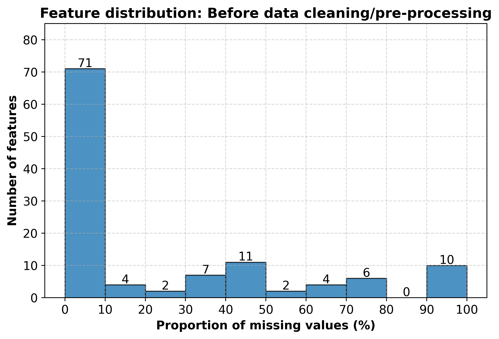

# 🌾 Farmer Producer Prices Forecasting (FAOSTAT, 2001-2023)

Forecasting agricultural Producer Price Index (PPI) across countries and crops using multi-panel FAOSTAT data. The project builds a reproducible data pipeline (clean → integrate → impute → model) and evaluates classical baselines vs. ML models.

**Why this matters:** Farm-gate prices drive producer decisions, policy, and food security. Reliable forecasts help farmers, economists, and policymakers plan with less guesswork.

## Repository Map

- **Data cleaning notebooks:** [here](https://github.com/Leonidus1995/farmer-prices-forecasting/tree/main/files_data_cleaning)

- **Database + integration:** [here](https://github.com/Leonidus1995/farmer-prices-forecasting/tree/main/database_files)

- **Preprocessing:** [here](https://github.com/Leonidus1995/farmer-prices-forecasting/blob/main/pre_processing.ipynb)

- **Imputation:** 
    - [Assessment for imputation](https://github.com/Leonidus1995/farmer-prices-forecasting/blob/main/data_imputation.ipynb)
    - [Imputation of 55 item-independent columns (LightGBM)](https://github.com/Leonidus1995/farmer-prices-forecasting/blob/main/dataset_1.ipynb)
    - [Imputation of 15 item-independent columns (KNN, TVAE)](https://github.com/Leonidus1995/farmer-prices-forecasting/blob/main/dataset_1_second.ipynb)
    - [Imputation of 8 item-dependent columns](https://github.com/Leonidus1995/farmer-prices-forecasting/blob/main/dataset_1_third.ipynb)

- **Post-Imputation Data Exploration:** [here](https://github.com/Leonidus1995/farmer-prices-forecasting/blob/main/eda.ipynb)

- **Models:**
    - [Baseline model](https://github.com/Leonidus1995/farmer-prices-forecasting/blob/main/base_model.py)
    - [LightGBM model](https://github.com/Leonidus1995/farmer-prices-forecasting/blob/main/LightGBM.py)

- **Model Evaluation Results:** [here]()

- **Figures/Plots:** [here](https://github.com/Leonidus1995/farmer-prices-forecasting/tree/main/plots)

## Data Sources ([FAOSTAT](https://www.fao.org/faostat/en/#data))

Target + predictors assembled yearly by (country × item):

- **Target:** Producer Price Index (PPI) (we drop sparse raw producer_price in favor of PPI coverage).

- **Predictors:** Agronomic (production/yield/area), trade (imports/exports, openness indices), inputs (fertilizer/pesticide), macro indicators (GDP, value added), government finance (expenditure, credit), FDI, employment/demographics, climate/environment (temperature, emissions), and land use.

## Pipeline Overview

1. **Ingest & Clean (per-dataset):** Raw CSVs from FAOSTAT cleaned with Pandas.

    - Notebooks: [here](https://github.com/Leonidus1995/farmer-prices-forecasting/tree/main/files_data_cleaning)

    - Pre-clean feature coverage: 
    
    

2. **Relational Integration (PostgreSQL):**

    - Create tables + load cleaned data → integrate by (area/country, year, item).

    - Code & SQL: [here](https://github.com/Leonidus1995/farmer-prices-forecasting/tree/main/database_files)

3. **Pre-processing & Feature Reduction:**

    - Start: 392,856 rows × 116 features.

    - Drop 10 features with >90% missingness (e.g., market concentration indexes, self-sufficiency ratio, etc.).

    - Item filtering: remove 43 animal-related items + 25 systematically sparse items → retain 134 items.

    - Country filtering: retain 149/166 countries by excluding those with complete gaps in two key employment/credit features.

    - After reduction: 211,006 rows × 97 features.

    - Post-clean coverage:
    
    

    - Notebook: [here](https://github.com/Leonidus1995/farmer-prices-forecasting/blob/main/pre_processing.ipynb) 

## Missing Data Assessment → Imputation Plan

**Pain points:** Six variables had concentrated gaps (esp. 1990–2000 and 2024) including government expenditure and employment. We tested an analytical reconstruction of govt_expenditure_on_ag_forest_fish using AOI × ag share of GDP × total gov expenditure and reverted after observing bias.

### Key decisions:

- Target switched to PPI (better coverage); drop raw producer_price.

- Add regional/economic indicator columns (region, sub-region, LDC, EU, LIFDC) to enable context-aware imputation.

- Derive value_added_aff_per_total_fdi to retain investment signal while avoiding sparse raw FDI fields.

- Dual dataset strategy to respect temporal gaps:

    - Dataset-1 (2001–2023): keep all 106 features, avoid the early-decade missing blocks.

    - Dataset-2 (1991–2023): drop the 6 chronically sparse features to preserve the full time span.

*Where to look:*

- Figures:
    - [Pairwise correlations in missingness (top 40 variables)](https://github.com/Leonidus1995/farmer-prices-forecasting/blob/main/plots/heatmap_top40.png)
    - [Matrix-plot for missingness (top 30 variables)](https://github.com/Leonidus1995/farmer-prices-forecasting/blob/main/plots/matrixplot_top30.png)
    - [Heatmap displaying data coverage (top 30 variables)](https://github.com/Leonidus1995/farmer-prices-forecasting/blob/main/plots/heatmap_missing_top30.png)

- Detailed narrative + decisions: [here](https://github.com/Leonidus1995/farmer-prices-forecasting/blob/main/data_imputation.ipynb)

## Imputation Methods (Dataset-1 focus)

**Guardrails:**

- No look-ahead (train-window imputation only: 2001–2021).

- Split scope: country-only vs. country×item variables.

- Short gaps: linear, LOCF/NOCB.

- Climate deltas (low missingness): sub-region means.

- Fertilizer production zero-logic (nitrogen/phosphorus): rules for plausible zeros at series edges / majority-zero series.

**ML imputation for item-independent predictors (55 columns):**

- LightGBM, column-wise, from lowest → highest missingness so later models can borrow newly imputed predictors.

- Train on non-missing rows (2001–2021); 10% validation split.

- Objective: Tweedie for non-negative targets, otherwise regression.

- Keep imputed columns only if they pass all: R² ≥ 0.70, MAPE ≤ 50%, nRMSE_mean ≤ 0.5.

- Results & table: see metrics → [impute_metrics.html](https://github.com/Leonidus1995/farmer-prices-forecasting/blob/main/impute_metrics.html)

**For 15 hard columns:**

Compared LightGBM vs. TVAE vs. KNN-Imputer on a pooled, fully-observed subset
(excluding 2023, one validation row per country; 1,931 train / 112 val).

- Imputation results:

    - [metrics_lgbm.html](https://github.com/Leonidus1995/farmer-prices-forecasting/blob/main/metrics_lgbm.html)
    - [metrics_knn.html](https://github.com/Leonidus1995/farmer-prices-forecasting/blob/main/metrics_knn.html)
    - [metrics_tvae.html](https://github.com/Leonidus1995/farmer-prices-forecasting/blob/main/metrics_tvae.html)

*Useful visuals:*

- Temporal trends:

- Weak autocorrelation → favors cross-sectional ML over ARIMA for imputation:

*Notebooks:* dataset_1.ipynb, data_imputation.ipynb

## 🔍 Post-Imputation Data Exploration

Once all missing values were imputed, we carried out an exploratory analysis to validate data integrity and understand key relationships among variables before modeling.

## 🤖 Modeling

**Target:** producer_price_index (PPI)

**Baseline:** Mean of prior three years (2020–2022) per country-item.

- Code: base_model.py

**ML models:** Gradient-boosted trees (LightGBM) with cross-sectional signals.

- Code: LightGBM.py

- Model metrics: 

## Reproduce the Pipeline

*Assumes Python + Jupyter. Use the notebooks in order.*

1. **Preprocess & integrate**

- Run: pre_processing.ipynb

- (Optional DB route: see database_files/)

2. **EDA**

- Run: eda.ipynb

- See plots in plots/

3. **Imputation**

- Strategy & diagnostics: data_imputation.ipynb

- Dataset-1 runs: dataset_1.ipynb

- Extended experiments: dataset_1_second.ipynb, dataset_1_third.ipynb

4. **Modeling**

- Baseline: base_model.py

- LightGBM: LightGBM.py

- Review metrics: metrics_lgbm.html, metrics_knn.html, metrics_tvae.html

## Results at a Glance (where to look)

- **Pre/post cleaning coverage:** plots/feat_dist_pre_clean.png, plots/feat_dist_post_clean.png

- **Missingness structure:** plots/heatmap_top40.png, plots/matrixplot_top30.png, plots/heatmap_missing_top30.png

- **Dataset-1 feature gaps:** plots/feature_distribution_dataset_1.png, plots/top_missing_cols_dataset_1.png

- **Autocorrelation check:** plots/dataset_1_autocorrelation_plot1.png (+2/3)

- **Imputation model performance:** metrics_lgbm.html, metrics_knn.html, metrics_tvae.html

